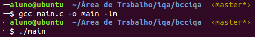
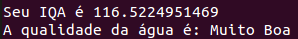

# Índice de Qualidade da Água(IQA)
O sofware tem como objetivo realizar o cálculo o Índice de Qualidade da Água(IQA).

##Usando o programa:
Para utilizar o programa antes de tudo é necessaria compilar o mesmo, para realizar tal processo pasta realizar o comando abaixo:
```
gcc main.c -o main -lm
./main
```



Após isso basta preencher os parametros solicitados pelo programa para saber o resultado(IQA).



#Observação:
Para os usuários do SO Windows é necessario instalar o módulo **gcc**, para isso basta seguir a tutorial desse site: http://terminaldeinformacao.com/2015/10/08/como-instalar-e-configurar-o-gcc-no-windows-mingw/

por [Douglas dos Santos Brito](https://github.com/dbrito)
